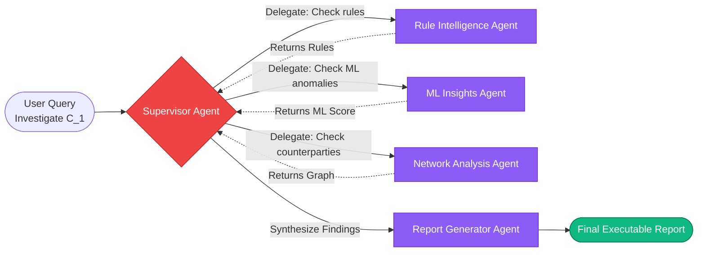
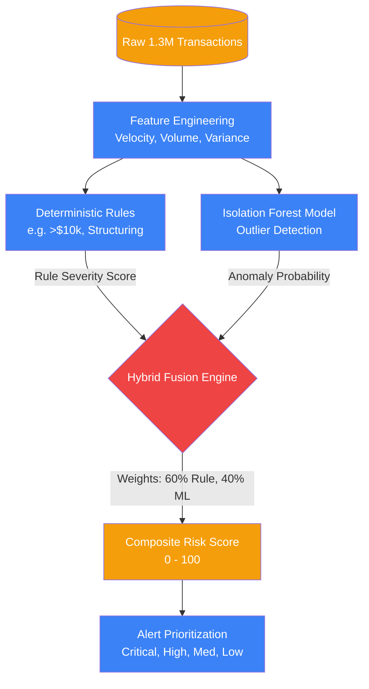
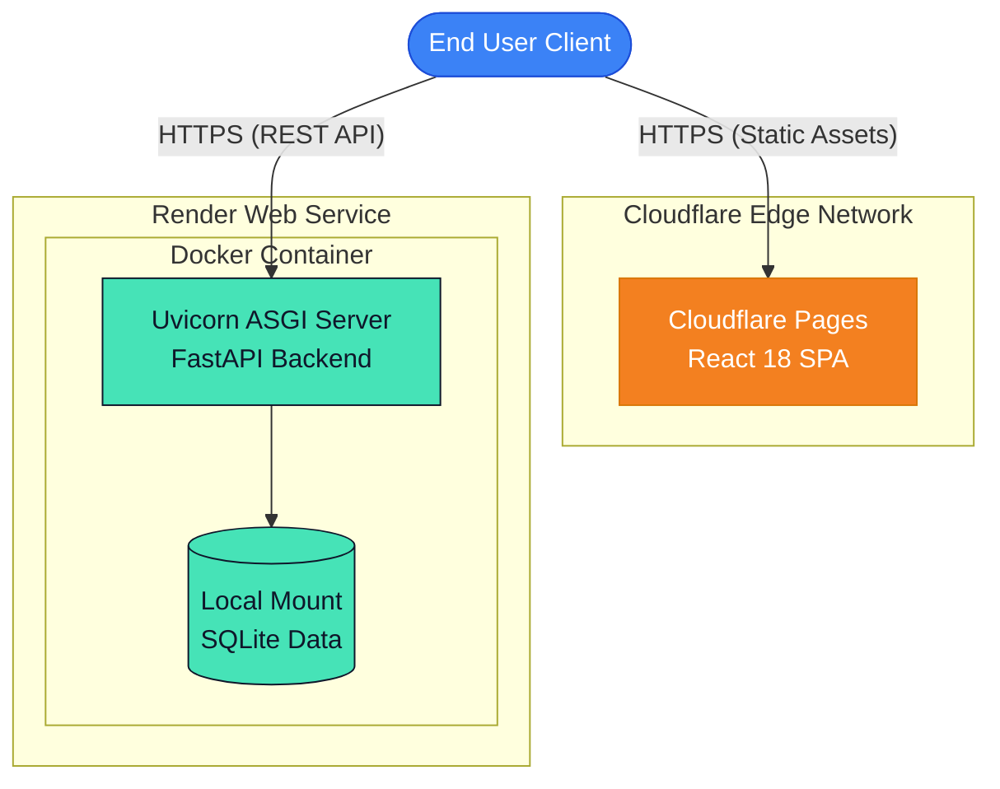

# FinShield AI
**An Enterprise Agentic AI-Powered Anti-Money Laundering (AML) Investigation Platform**

> [!IMPORTANT]
> **Note for Hackathon Judges**  
> For your convenience, we have fully deployed our submission to the cloud:
> - **Live Demo (Frontend):** [https://finshield-ai.pages.dev/](https://finshield-ai.pages.dev/login)  
> - **Live API Docs (Backend):** [https://finshield-backend-131d.onrender.com/docs](https://finshield-backend-131d.onrender.com/docs)  
> *(Note: The backend is hosted on Render's Free Tier and the frontend is on Cloudflare Pages. Please allow up to 50 seconds for the backend to cold-start on your first request.)*


---

## Table of Contents
1. [Problem Statement](#problem-statement)
2. [Our Solution](#our-solution)
3. [System Architecture](#system-architecture)
4. [Dataset & Scale](#dataset--scale)
5. [Tech Stack](#tech-stack)
6. [Getting Started (Docker)](#getting-started)
7. [API Documentation](#api-documentation)

---

## Problem Statement
**Targeting Problem Statement 1: AI-Powered Suspicious Activity Detection**

Financial institutions face strict mandates from regulatory bodies (e.g., FinCEN, FATF) to maintain robust AML compliance programs. However, traditional legacy systems suffer from two major architectural flaws:
1. **Rule-Based Rigidity:** Static thresholds generate a flood of false positives, exhausting compliance analysts.
2. **Evasion by Design:** Sophisticated laundering networks utilize structuring, smurfing, and layering to intentionally bypass traditional deterministic rules.

**The Result:** A reliance on "Black Box" models where compliance teams cannot explain the underlying rationale of flagged transactions, leading to regulatory friction and prolonged investigations.

---

## Our Solution
FinShield AI resolves these challenges by deploying an **Autonomous Agentic Swarm**. 

Rather than serving as a thin wrapper around a Large Language Model, FinShield operates as a deeply integrated AI Investigation Partner. It parses intents via an orchestrator LLM to dynamically coordinate nine specialized, deterministic, and mathematical AI Agents (via **LangGraph**), ultimately generating a fully transparent, evidence-backed Suspicious Activity Report (SAR). 

FinShield fundamentally fuses deterministic rules (for strict regulatory compliance), Graph Network Analysis (for counterparty risk), and unsupervised machine learning (Isolation Forests) into a proprietary hybrid risk engine.

---

## System Architecture
FinShield AI abandons the concept of a fixed, linear pipeline. Our system architecture is categorized into three core pillars: The Agentic Swarm, the Hybrid Risk Data Pipeline, and our Global Edge Cloud Deployment.

### Agentic Swarm Architecture
FinShield AI utilizes an advanced **LangGraph Multi-Agent Topology**.

**The 9-Agent Swarm**
When an investigation is triggered, the **Supervisor Agent** coordinates a decentralized network of specialized workers:



**Agent Breakdown:**
1. **Customer Agent**: Analyzes KYC profile, risk history, and jurisdictional risk.
2. **Transaction Agent**: Calculates velocity, rolling sums, and temporal cash flows.
3. **Network Agent**: Traces entity linkage and graph connectivity risk.
4. **Rule Intelligence Agent**: Executes deterministic AML regulations (e.g., structuring alerts, FATF lists).
5. **ML Intelligence Agent**: Runs unsupervised anomaly detection (Isolation Forest) on engineered features.
6. **Compliance Agent**: Fuses ML scores and Rule triggers into a final Hybrid Risk Score.
7. **Evidence Aggregator**: Compiles a structured evidence graph with attribution percentages.
8. **Report Generator**: Synthesizes the structured evidence graph into a human-readable SAR.
9. **Audit Agent**: Logs all immutable actions to the SQLite database.

### Data Pipeline & Hybrid Risk Engine
To process our massive dataset (1.3M+ rows) in real-time, FinShield uses an advanced Hybrid Risk Engine that fuses deterministic rules with machine learning.



### Cloud Deployment Architecture
Our platform is deployed using a secure cloud architecture leveraging **Render** and the **Cloudflare Edge Network**.



---

## Dataset & Scale
We utilize the **IBM AML Simulation Dataset** (1.3M+ rows), which provides highly realistic, imbalanced fraud data containing fan-in, fan-out, and bipartite laundering topologies.

| File | Rows | Description |
|------|------|-------------|
| `transactions.csv` | **1,323,234** | The core financial transaction ledger. |
| `accounts.csv` | ~10,000 | Account and customer KYC metadata. |
| `alerts.csv` | 1,719+ | Known suspicious alert events (0.13% fraud rate). |

---

## Tech Stack
| Layer | Technology |
|-------|-----------|
| **Frontend** | React 18, TypeScript, Vite, Tailwind CSS, Framer Motion |
| **Backend** | Python 3.11, FastAPI, Uvicorn |
| **Agentic AI** | LangGraph, LangChain, Large Language Model (Orchestration) |
| **Machine Learning** | scikit-learn (Isolation Forest), Pandas, NumPy |
| **Database** | SQLite (Immutable Audit Trails) |
| **DevOps** | Docker, Docker Compose |

---

## Getting Started

The platform is fully containerized. You do not need to install Python or Node locally.

### Prerequisites
- [Docker & Docker Compose](https://www.docker.com/)
- An **LLM API Key** (We default to Google Gemini `gemini-2.5-flash` for the hackathon).

### 1. Clone & Configure
```bash
git clone https://github.com/subh-ghosh/finshield-ai.git
cd finshield-ai

# Configure your API key
cp backend/.env.example backend/.env
# Open backend/.env and paste your GEMINI_API_KEY
```

### 2. Boot the Platform
```bash
docker-compose up --build
```
*Note: On the first boot, the backend will process the 1.3M row dataset and build the ML models. This takes ~60 seconds. Subsequent boots utilize the cache instantly.*

### 3. Access
- **Investigation Dashboard (Frontend)**: [http://localhost:5173](http://localhost:5173)
- **OpenAPI Swagger (Backend)**: [http://localhost:8000/docs](http://localhost:8000/docs)

---

## API Documentation
FinShield exposes a comprehensive REST API for enterprise integration.

| Endpoint | Method | Description |
|----------|--------|-------------|
| `/api/v1/planner/investigate` | POST | Triggers the 9-Agent LangGraph Swarm to investigate a customer. |
| `/api/v1/risk-classify/{id}` | GET | Returns the Hybrid Risk Score (Rules + ML) for an entity. |
| `/api/v1/simulation/what-if` | POST | Counterfactual simulator: predicts risk changes before transactions occur. |
| `/api/v1/anomaly/{id}` | GET | Isolation Forest anomaly scoring and confidence metrics. |
| `/api/v1/customer/{id}` | GET | Fetches the engineered feature vector and KYC profile. |

---

### AI Assistance & External Tools Disclosure
*As required by Hackathon rules:*
- **Generative AI / LLM APIs (e.g. Gemini / OpenAI)**: Used as the core orchestrator for agent intent parsing, reasoning, and report synthesis within our platform.
- **AI Coding Assistants**: We leveraged AI coding assistants (like GitHub Copilot and Agentic Ideation Tools) for brainstorming, accelerating boilerplate generation, debugging, and polishing documentation during the hackathon sprint.
- **LangGraph & LangChain**: Open-source framework used for Multi-Agent Orchestration.
- **react-force-graph-2d**: Open-source visualization for the Knowledge Graph.
- **scikit-learn**: Open-source library used for the Isolation Forest ML model.
