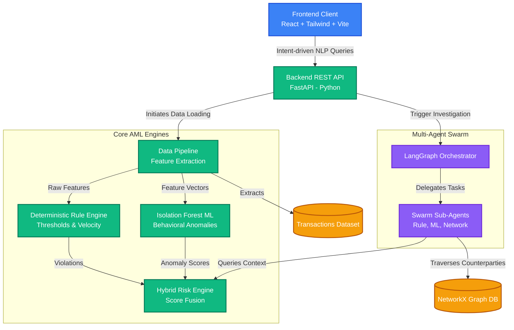
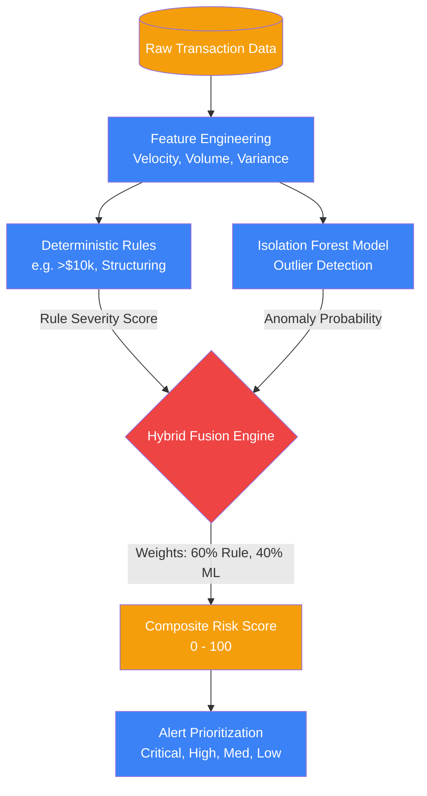

# FinShield AI: Detailed Technical Documentation & Architecture

## 1. Executive Summary
FinShield AI is a next-generation Anti-Money Laundering (AML) platform designed to solve the critical issue of "alert fatigue" in financial compliance. By fusing deterministic rule engines with Machine Learning anomaly detection and orchestrating investigations via a **LangGraph Multi-Agent Generative AI swarm**, FinShield AI reduces false positives, automates manual data gathering, and provides completely transparent, explainable results to compliance officers.

---

## 2. Platform Architecture

The platform is built on a modern, decoupled architecture designed for high throughput, real-time inference, and autonomous orchestration.

### 2.1 High-Level System Architecture



### 2.2 Backend (Python & FastAPI)
- **API Layer:** FastAPI provides a high-performance, asynchronous REST API.
- **Orchestration Layer:** LangGraph manages the stateful execution of the Multi-Agent Swarm.
- **Network Graph Analysis:** Utilizing **NetworkX**, the backend constructs directed graphs of transactions to detect cyclic funds transfers and nested shell company relationships.

### 2.3 Frontend (React & TypeScript)
- **Framework:** React 18 with TypeScript and Vite.
- **State Management:** React Query manages server state, caching pipeline results and queue data.
- **UI & Animations:** Tailwind CSS and Framer Motion are used to visually simulate the real-time execution of the multi-agent swarm, providing user feedback during the autonomous investigation.

---

## 3. The Multi-Agent Orchestration Swarm

Rather than using a single monolithic LLM prompt, FinShield AI uses a graph-based multi-agent system where specialized agents perform distinct analytical tasks.

```mermaid
flowchart LR
    %% Styles
    classDef supervisor fill:#ef4444,stroke:#b91c1c,color:#fff;
    classDef worker fill:#8b5cf6,stroke:#6d28d9,color:#fff;
    classDef output fill:#10b981,stroke:#047857,color:#fff;

    User([User Query<br/>"Why is C_1 suspicious?"]) --> Supervisor
    
    Supervisor{Supervisor Agent}:::supervisor
    
    Supervisor -- "Delegate: Check rules" --> RuleAgent[Rule Intelligence Agent]:::worker
    Supervisor -- "Delegate: Check ML anomalies" --> MLAgent[ML Insights Agent]:::worker
    Supervisor -- "Delegate: Check counterparties" --> NetworkAgent[Network Analysis Agent]:::worker
    
    RuleAgent -. "Returns Rules" .-> Supervisor
    MLAgent -. "Returns ML Score" .-> Supervisor
    NetworkAgent -. "Returns Graph" .-> Supervisor
    
    Supervisor -- "Synthesize Findings" --> ReportAgent[Report Generator Agent]:::worker
    ReportAgent --> FinalReport([Final Executable Report]):::output
```

**Agent Roles:**
1. **Customer & Transaction Agents:** Fetches historical profiles and extracts timeseries metrics.
2. **Rule Intelligence Agent:** Evaluates hard threshold rules.
3. **ML Intelligence Agent:** Evaluates Isolation Forest behavioral anomalies.
4. **Compliance Agent:** Merges outputs through the Hybrid Fusion Engine.
5. **Report Generator:** Synthesizes the final deterministic recommendation (e.g., "FILE_SAR", "ESCALATE").
6. **Audit Agent:** Generates an immutable JSON audit log.

---

## 4. Analysis Algorithms & Hybrid Risk Engine

The Hybrid Risk Engine resolves the conflict between rigid rules (which generate false positives) and probabilistic ML (which lacks explainability).



- **Deterministic Rules:** Catches known typologies (e.g., structuring, rapid velocity).
- **Isolation Forest (ML):** Evaluates multidimensional behavioral features to isolate outliers in the feature space.
- **Fusion Logic:** A customer is only flagged as "Critical" if they exhibit both deterministic rule violations *and* statistically significant behavioral deviations.

---

## 5. User Interface Design & Explainability

### 5.1 Intent-Driven NLP Search
Instead of complex navigation menus, the platform features a global NLP search bar. Users can type full conversational questions (e.g., *"Why is C_1580 suspicious?"*). The frontend automatically uses regex parsing to extract the Customer ID and dynamically route the user directly to the active investigation workspace for that specific customer.

### 5.2 Multi-Agent Swarm Visualization
A core differentiator is how the AI operates visually. The UI cycles through the active LangGraph agents as they process the data. This "Human-in-the-Loop" design builds trust, showing the compliance officer exactly what the AI is analyzing at any given moment.

### 5.3 Interactive Explainability (Counterfactual Simulator)
To comply with regulatory demands against "Black Box" AI, the UI features a **Counterfactual Simulator**. Compliance officers can use sliders to artificially adjust a customer's transaction volume or velocity. The UI instantly recalculates the ML anomaly score and Rule Engine hits, mathematically proving *why* the model made its decision.
