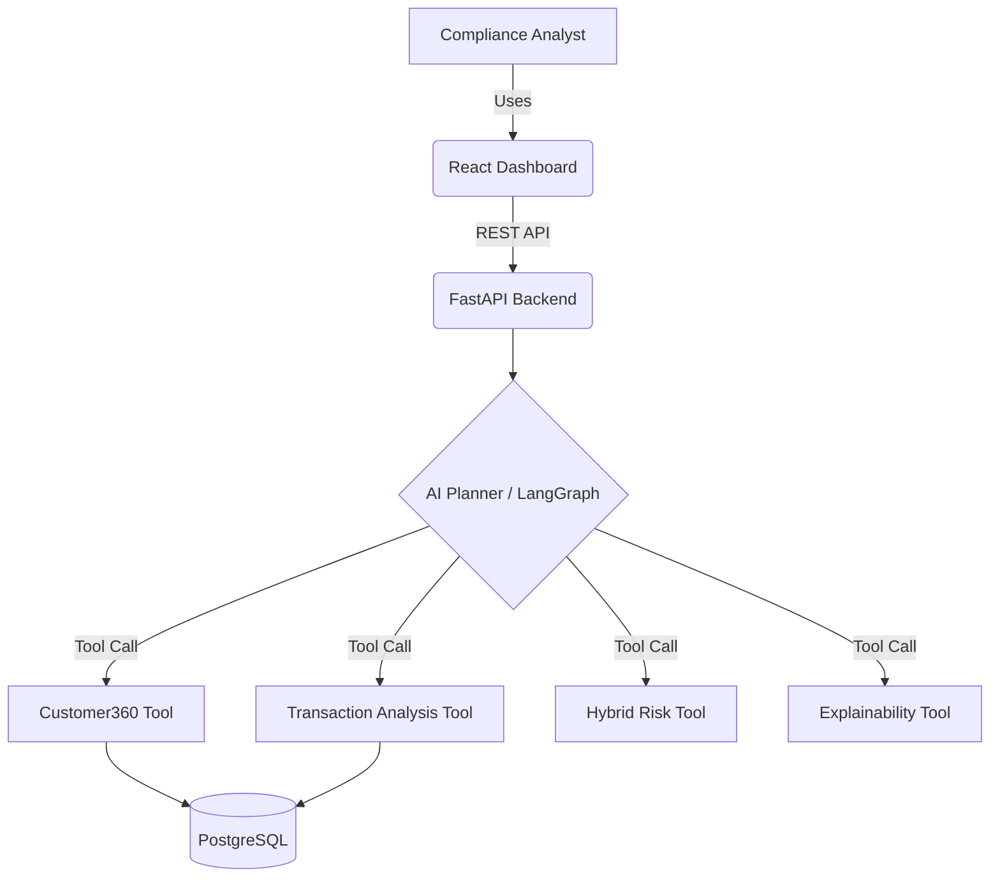

# Architecture & Design Document

## 1. High-Level Architecture
FinShield AI is built as a modular, API-first enterprise application. For the hackathon MVP, we use a simplified, high-velocity tech stack that maintains enterprise-grade separation of concerns.

### Tech Stack
*   **Frontend**: React, Tailwind CSS, shadcn/ui
*   **Backend / API Gateway**: FastAPI (Python)
*   **AI Orchestration**: LangGraph, Gemini 3.1 Pro
*   **Database**: PostgreSQL / SQLite (for rapid prototyping)

*Note: The original proposal included Spring Boot, Neo4j, and Kubernetes. These have been explicitly simplified for the 48-hour hackathon constraints to prioritize a flawless end-to-end demo and speed of delivery, while retaining the logical separation of these services.*

## 2. System Context

## 3. The AI Planner (Agentic Core)
The AI Planner (built with LangGraph) is the brain of the system. 
When a request is received, the planner executes a state machine:
1.  **Intent Engine**: Parses the user's natural language query to determine the objective.
2.  **Context Manager**: Gathers basic context (e.g., loading customer ID).
3.  **Planning Engine**: Decides *which* tools to call and in *what order*.
4.  **Execution Manager**: Invokes the tools (e.g., ML Anomaly Detection, Rule Engine, Graph Analysis).
5.  **Evidence Aggregator**: Compiles the outputs of all tools.
6.  **Explainability Engine**: Translates the raw data into a human-readable justification.

## 4. Core Analytical Modules
*   **Customer Intelligence**: Retrieves unified KYC and account data.
*   **Transaction Intelligence**: Filters, aggregates, and detects suspicious patterns (e.g., velocity spikes, structuring).
*   **Hybrid Risk Engine**: Computes a final risk score by combining deterministic rules (e.g., "Transactions > $10,000") with ML-based anomaly detection (Isolation Forest).
*   **Report Generator**: Drafts automated investigation summaries.

## 5. Security & Governance (Human-in-the-Loop)
*   The AI operates as a decision-support system. It **cannot** automatically close an investigation or file a regulatory report.
*   The UI must include an **Evidence Panel** that clearly links every AI claim to a specific data point or transaction.
